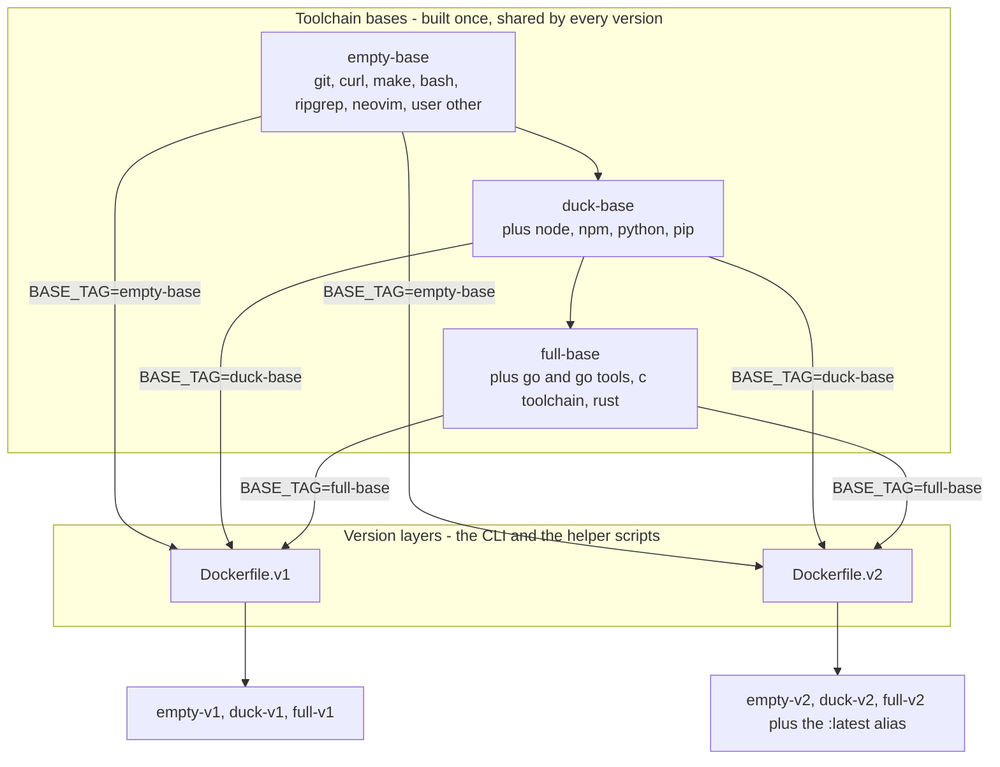

# opencode dev container

[](https://github.com/snowdon-dev/opencode-docker/actions/workflows/ci.yaml)
[](https://hub.docker.com/r/devsnowdon/opencode-docker)
[](https://hub.docker.com/r/devsnowdon/opencode-docker)
[](https://github.com/snowdon-dev/opencode-docker/blob/main/LICENSE)

| Version | Empty | Duck | Full |
|---|---|---|---|
| v2 |  |  |  |
| v1 |  |  |  |

A security and human-control oriented [opencode](https://opencode.ai) workflow
that runs in Docker containers. The current project bind-mounted at
`/workspace/project`, plus persistent caches for full language toolchains installed in
the image (Go, Rust, Node, Python). All features are security first with
convenience opts in.

This project has been designed for arm architecture devices like the [Raspberry
Pi](https://www.raspberrypi.com/). However, it should be compatible with x86.

The version of opencode is best-effort and updated periodically (weekly), feel
free to file an issue if it is out-of-date. See [Build](#build) section.

## Commands

Run commands through the launcher; the workspace defaults to the current
directory. Every command has its own help: `opencode:help <command>` or
`opencode:<command> -h`.

| Command | Alias | Purpose |
|---------|-------|---------|
| `opencode` (`start`) | `oc` | (Re)create the container and attach a TUI |
| `opencode:scaffold [path] <task>` | `ocsf` | Create a new project with opencode (task via stdin) |
| `opencode:bg [path] <task>` | `ocbg` | Run a one-off opencode task (an opencode run in the service) on an existing project |
| `opencode:changes [task]` | `occh` | Analyse the branch changes and propose a plan |
| `opencode:new` | `ocn` | Stop existing containers, then start a fresh session |
| `opencode:up` | `ocu` | Start the container in the background, running nothing |
| `opencode:setup <cmd>` | `ocset` | Start the container if needed, then run a command in it |
| `opencode:uptree` | `ocut` | Start a container for an existing agent worktree |
| `opencode:run <cmd>` | `ocr` | Run a task (docker task, docker run) in the service, one-off container if not running |
| `opencode:exec <cmd>` | `oce` | Run a command interactively in the running container |
| `opencode:shell` | `ocsh` | `exec sh` |
| `opencode:repl` | `ocrepl` | Interactive bash shell bound to the workspace |
| `opencode:compose <args>` | `occ` | Pass arguments straight through to `docker compose` |
| `opencode:stop` | `ocs` | Stop managed containers |
| `opencode:delete` | `ocdel` | Force-remove managed containers (`--all` also drops images and networks) |
| `opencode:down` | `ocd` | Remove this project's containers, networks and volumes |
| `opencode:ls` (`list`) | `ocl` | List managed containers in a ps-style table |
| `opencode:git <args>` | `ocg` | Run git on the host, in the workspace |
| `opencode:env` | `ocenv` | Print the launcher variables set in your environment (`SD_*`, `OPENCODE_*`) |
| `opencode:create <action>` | `occre` | Create a workspace asset on the host (`--dockerfile`, `--worktree`) |
| `opencode:update` | `ocud` | Refresh the launcher repo and its images |
| `opencode:help [command]` | `och` | Show help, or help for one command |

### Common options

Accepted by `stop`, `delete`, `ls` and `down` (each honours the subset that
applies to it):

| Option | Effect |
|--------|--------|
| `--all`, `-a` | Also act on one-off (`compose run`) containers and resources (images, networks) |
| `--other`, `-o` | Act on everything except the current workspace and its worktrees |
| `--this`, `-t` | Act on the current workspace (the default when no path is given) |
| `--quiet`, `-q` | `ls` only: print just the container ids, one per line |
| `--dry-run`, `-n` | Print what would be done without touching anything (`down`, `stop`, `delete`) |
| `--` | Stop parsing options; everything after is a positional argument |

An optional positional argument is a workspace path, or a container-id prefix
(ambiguous prefixes are rejected). `--other` and `--this` are mutually exclusive,
and `down` refuses both: it only ever removes the current project.

Images and networks are labelled with the workspace that created them, which for
a worktree is the worktree's own path, plus the worktree's parent repository.
`delete --all` scoped to a repository therefore covers the repository's worktrees
as well, and `--other` preserves them with the repository.

### Create options

`opencode:create` (`occre`) creates a workspace asset on the host. Every action
is requested by its own option — there is no default action, so a bare
`opencode:create` lists them — and several can be combined in one invocation,
running in the order given:

| Option | Effect |
|--------|--------|
| `--dockerfile`, `--Dockerfile`, `-df` | Copy `Dockerfile.example` to `<workspace>/ocdocker/` and print the exports that build the workspace image from it |
| `--worktree`, `--wt`, `-w` | Create the agent worktree `opencode:uptree` expects at `$SD_AGENT_TREE_ROOT/<project>-dev` |
| `[branch]` (positional) | The branch to create for `--worktree` (default: `<project>-dev`, created from the current HEAD) |

### Examples

```shell
# a workspace argument overrides the current directory
opencode /home/other/somerepo
opencode:exec /home/other/somerepo sh
opencode:down /home/other/somerepo
opencode:delete "$(pwd)" --all
opencode:ls --quiet ~/somerepo
opencode:compose exec -it opencode sh

# long tasks, then work in the same container
opencode:run npm install
opencode:setup sh -c 'cd front-end && npm install' && opencode

# tasks, replacing the session or analysing the branch first
opencode -c --auto
opencode:changes "identify issues in these changes"
opencode:bg ./ "refactor this module"

# new projects, either with a real path or under $SD_REPO_HOME
opencode:scaffold /tmp/project < /tmp/sometask.md
opencode:scaffold --path gists/project-1 "Create basic hello world html project"

# workspace assets, and an agent worktree to run in
opencode:create --dockerfile
opencode:create --worktree feature/my-branch
opencode:create --dockerfile --worktree && opencode:uptree

# run on another base image, or pin and cap the CPUs
OPENCODE_IMAGE_URL="devsnowdon/opencode-docker:full-v1" opencode
OPENCODE_CPUSET="2-3" OPENCODE_CPUS="2" opencode

# using opencode v2
OPENCODE_IMAGE_URL="devsnowdon/opencode-docker:empty-v2" \
OPENCODE_IMAGE_URL_TUI="devsnowdon/opencode-docker:empty-v2" opencode
```

## Install

Clone the repository to `~/opencode`:

```shell
git clone https://github.com/snowdon-dev/opencode-docker.git ~/opencode
```

`scripts/launcher.sh` looks for the compose files in `~/opencode`, so link the
repository there. This also means a `.env` placed in the repository root is
picked up by plain `docker compose` runs.

Only one environment variable is required, `SD_OPENCODE`. The rest are for
custom configuration or custom profiles: the path variables are read by compose
([Compose variables](#compose-variables)), the launcher variables by the script
itself ([Launcher variables](#launcher-variables)).

### oh-my-zsh plugin

The launcher sets up the required environment variables, such as `WORKSPACE`,
so use it to launch the container. The `omz` plugin is very lightweight and not
required — you are encouraged to create your own profiles and environments
using whichever shell you prefer. To install it, link it as an oh-my-zsh custom
plugin:

```sh
mkdir -p "${ZSH_CUSTOM:-$HOME/.oh-my-zsh/custom}/plugins/opencode"
ln -s ~/opencode/omz/opencode.zsh \
    "${ZSH_CUSTOM:-$HOME/.oh-my-zsh/custom}/plugins/opencode/opencode.plugin.zsh"
```

Then enable it in `~/.zshrc` and point `$SD_OPENCODE` at the repository
(the aliases use it to find the repo):

```sh
export SD_OPENCODE="$HOME/opencode"
export SD_REPO_HOME="$HOME/repos"
plugins=(... opencode)
```

After restarting your shell (`exec zsh`), list the commands with
`alias | grep -E ^oc`. The plugin wraps the launcher in one alias per command
(`oc`, `ocs`, `ocu`, `ocn`, `ocsh`, `ocset`, `ocr`, `ocd`, `ocdel`, `ocl`,
`occ`, `occh`, `ocsf`, `ocbg`, `ocg`, `ocenv`, `ocut`, `och`, `ocud`, `ocrepl`,
`occre`)
— see [`omz/opencode.zsh`](omz/opencode.zsh) for the exact list.

### Environment setup steps

- `SD_OPENCODE` must point at the repository (default `$HOME/opencode`).
- Docker is required [docker.io](https://www.docker.com/). For extra security
    use docker rootless. `SD_DRIVER` selects the engine, but only `docker` is
    implemented.
- A modern version of bash is required.
- The opencode binary from the shell path runs the TUI (`npm i -g
    opencode-ai`); without it the in-container `tui` service is used instead.
- CPUs are unrestricted by default; restrict them with `OPENCODE_CPUSET`
    (pinning) or `OPENCODE_CPUS` (limit).
- If you want something to build on every workspace without its own
  `OPENCODE_DOCKERFILE`, you can `cp "$SD_OPENCODE/Dockerfile.example"
  "$SD_OPENCODE/Dockerfile`, and that Dockerfile will be built if there is no
  `OPENCODE_DOCKERFILE` set.

### Creating the directories

The container runs as the `other` user (uid/gid `1000`), so every host
directory bind-mounted under `/home/other/...` (see
[`docker-compose.yml`](docker-compose.yml)) must exist and be writable by that
user. Three of them are always mounted, so create and hand them over with
default paths:

```sh
mkdir -p \
    "$HOME/.cache/opencode/cache" \
    "$HOME/.local/share/opencode" \
    "$HOME/.config/opencode"
chown -R 1000:1000 \
    "$HOME/.cache/opencode" \
    "$HOME/.local/share/opencode" \
    "$HOME/.config/opencode"
```

The toolchain caches (`OPENCODE_PIP_CACHE_DIR`, `OPENCODE_NPM_CACHE_DIR`,
`OPENCODE_GO_BUILD_CACHE_DIR`, `OPENCODE_GO_MOD_CACHE_DIR`,
`OPENCODE_CARGO_REGISTRY_DIR`, `OPENCODE_CARGO_GIT_DIR`, `OPENCODE_SCCACHE_DIR`)
are only mounted when you enable them with `OPENCODE_CACHE`, so create and
chown them only if you do. Each one defaults to the conventional path under
your home directory; see [Compose variables](#compose-variables). To find the
exact volumes used, view the merged compose file with `opencode:comopse config`
or `occ config`.

Your project workspace also gets bind-mounted (at `/workspace`) and is written
to by the container, so it too must be owned by `1000:1000`:

```sh
chown -R 1000:1000 "$WORKSPACE"
```

> If you override any path via `.env` (e.g. `OPENCODE_SCCACHE_DIR`), create
> that directory instead and `chown -R 1000:1000` it. Do not run these commands
> with `sudo` unless the directories live outside your home directory.

## How a session starts

`opencode` (the `start` command) starts an `opencode serve` backend inside the
container, waits for it to become healthy, then starts a TUI — a host
`opencode` binary when one is on the `PATH`, otherwise the one-off `tui`
service. The backend is published on a host port only in the first case;
otherwise it is reachable only on the compose network, so one project's backend
cannot be reached from another project's host processes. It is killed when the
TUI exits. The wait is a single `scripts/waitforserver.sh` process polling the
backend's health endpoint (`/api/health` on v1, `/global/health` on v2) from the
side that can reach it — on the host, or inside the container where only the
service name resolves.

`run`, `changes` and `setup` use the running container when there is one and a
throwaway `compose run` container otherwise; `scaffold` and `bg` always use a
throwaway container.

## Security model

- The workspaces's `.git` directories are mounted read-only, so it cannot
  rewrite history; set `SD_READ_ONLY=false` to opt out.
- A worktree's parent repository `.git` is mounted read-only at its host path,
  which keeps git usable inside the container while isolating the workspace.
- Each workspace gets its own Docker network, allocated a subnet from the
  managed range, keeping workspaces isolated from each other.
- Toolchain caches and other host mounts are opt-in (`OPENCODE_CACHE`).
- A workspace outside `$HOME` prompts before it is used, unless `SD_YOLO=true`.

## Environment variables

### Compose variables

All host-side paths are configured with environment variables. Substitution
happens on the host when `docker compose` runs, and every variable has a
default pointing at the conventional location under your home directory
(`.cache`, `.local`, `.npm`, etc.).

| Variable                   | Default                          | Mounted at (container)              |
|----------------------------|----------------------------------|-------------------------------------|
| `WORKSPACE`                | `$SD_OPENCODE` (repo root)       | `/workspace`                        |
| `OPENCODE_NETWORK`         | –                                | – (external network, see `compose/net/docker-compose.network.yml`) |
| `OPENCODE_CACHE_DIR`       | `$HOME/.cache/opencode/cache`    | `/home/other/.cache/opencode/cache` |
| `OPENCODE_DATA_DIR`        | `$HOME/.local/share/opencode`    | `/home/other/.local/share/opencode` |
| `OPENCODE_CONFIG_DIR`      | `$HOME/.config/opencode`         | `/home/other/.config/opencode`      |
| `OPENCODE_PIP_CACHE_DIR`   | `$HOME/.cache/pip`               | `/home/other/.cache/pip`            |
| `OPENCODE_NPM_CACHE_DIR`   | `$HOME/.npm`                     | `/home/other/.npm`                  |
| `OPENCODE_GO_BUILD_CACHE_DIR` | `$HOME/.cache/go-build`       | `/home/other/.cache/go-build`       |
| `OPENCODE_GO_MOD_CACHE_DIR`   | `$HOME/go/pkg/mod`            | `/home/other/go/pkg/mod`            |
| `OPENCODE_CARGO_REGISTRY_DIR` | `$HOME/.cargo/registry`       | `/home/other/.cargo/registry`       |
| `OPENCODE_CARGO_GIT_DIR`      | `$HOME/.cargo/git`            | `/home/other/.cargo/git`            |
| `OPENCODE_SCCACHE_DIR`        | `$HOME/.cache/sccache`        | `/home/other/.cache/sccache`        |

The container-side paths are fixed: they must match the user baked into the
image (`other`, uid/gid 1000, see the `opencode/Dockerfile.*` variants).

### Launcher variables

These variables are read by `scripts/launcher.sh` from the shell environment
(they are not compose path variables):

| Variable                   | Default                    | Effect                                              |
|----------------------------|----------------------------|-----------------------------------------------------|
| `SD_OPENCODE`              | `$HOME/opencode`           | The repository holding the launcher and compose files |
| `SD_REPO_HOME`             | `/home/$USER/repos`        | Root for `scaffold`/`bg` `--path` targets, and the parent of the default agent worktree root |
| `SD_AGENT_TREE_ROOT`       | `$SD_REPO_HOME/agent-trees` | Root holding the agent worktrees `uptree` starts and `create --worktree` creates; it must exist |
| `SD_DRIVER`                | `auto`                     | Container engine: `auto`, `docker` or `podman`. Only `docker` is implemented; `podman` exits with an error |
| `OPENCODE_IMAGE_URL`       | `devsnowdon/opencode-docker:duck-v1` | – (build arg: base image for the `opencode` service) |
| `OPENCODE_IMAGE_URL_TUI`   | `devsnowdon/opencode-docker:empty-v1` | – (image for the `tui` service) |
| `OPENCODE_IMAGE_VERSION`   | `v1`                       | Version layer (`v1`, `v2`) of the published images the launcher pulls; the tag defaults above are built from it |
| `OPENCODE_CONTEXT`         | `.`                        | Docker build context directory passed to the compose `build` section. Derived from `OPENCODE_DOCKERFILE`'s directory when that is a file path and this is unset |
| `OPENCODE_DOCKERFILE`      | `Dockerfile`               | Dockerfile path (relative to the context) passed to the compose `build` section |
| `OPENCODE_COMPOSE`         | –                          | Space-separated extra `docker compose` files, merged into the project via `-f` |
| `OPENCODE_WORKSPACE`       | –                          | The current opencode workspace context; launches targeting a directory outside it prompt before using its environment |
| `OPENCODE_CACHE`           | –                          | Toolchain cache mounts to enable: `false` (default) none, `all` every cache, or space-separated ids (`go`, `node`, `python`, `rust`); any other id is rejected before the container is composed. Also selects the base image variant (`:empty-v1`, `:duck-v1`, `:full-v1`) unless `OPENCODE_IMAGE_URL` is set |
| `OPENCODE_BACKEND_ORIGIN`  | `http://opencode:4096`, else resolved from `compose port` | Backend URL used for the TUI connection |
| `OPENCODE_SERVER_PASSWORD` | –                          | Password for the backend's basic auth, passed to both the `opencode` and `tui` services. Unset leaves the backend open inside the compose network; the health endpoint the launcher probes stays reachable either way |
| `OPENCODE_CPUSET`          | –                          | CPU pinning (e.g. `2-3`); unset by default (Docker uses all CPUs) |
| `OPENCODE_CPUS`            | –                          | CPU limit (e.g. `2`); unset by default (no quota)    |
| `SD_YOLO`                  | –                          | `true` (case-insensitive) skips the outside-`HOME` workspace check |
| `SD_YOLO_HOME`             | –                          | `true` validates workspaces against `SD_REPO_HOME` instead of `$HOME` |
| `SD_READ_ONLY`             | –                          | `false` (case-insensitive) skips the read-only `.git` override file |
| `OPENCODE_NET_RANGE`       | `172.20.0.0/16`            | CIDR or bare prefix defining the managed IP range     |
| `OPENCODE_NET_SUBNET`      | `29`                       | Subnet mask for each workspace network               |
| `DOCKER_ARGS`              | –                          | – (extra args passed to all docker commands)         |
| `COMPOSE_ARGS`             | –                          | – (extra args passed to every `docker compose` command) |

### Network isolation

The launcher supports three network modes controlled by `OPENCODE_NETWORK`:

1. **Unset (default)** — no external network is attached; the container uses
    Docker's default bridge network.
2. **`@default` (recommended)** — the launcher automatically creates a
    workspace-scoped bridge network named `sd-<project>-default` and attaches
    it to both the `opencode` and `tui` services, with a subnet allocated from
    `OPENCODE_NET_RANGE`. The network is reused across restarts: the launcher
    looks for an existing network labelled with the workspace before creating
    one. Cleanup happens via `opencode:delete --all` or `docker network rm`.
3. **Named network** — pass any existing Docker network name to attach both
    services to it, sharing a network between workspaces or external services.

```sh
OPENCODE_NETWORK=@default opencode
OPENCODE_NETWORK="my-shared-net" opencode
```

#### Subnet allocation

The range is sliced by `OPENCODE_NET_SUBNET`. A subnet mask smaller than the
range mask is rejected, since it would overlap the other slices; a `/16` range
sliced with the default `/29` gives 8192 subnets (6 usable hosts each), and
with `/24` gives 256 subnets (254 usable hosts each). When every slice is taken
the launcher exits with an error.

### Setting variables

Launcher variables are read from the environment and should not be set in a
`.env` file. Compose variables are resolved in this order:

1. Shell environment (`export OPENCODE_CACHE_DIR=/big/disk/cache`)
2. A `.env` file next to your compose files (by default `~/opencode/.env`,
    which is the project directory `docker compose` reads from)
3. The inline defaults in `docker-compose.yml`

To see what the launcher will actually read, print the relevant variables with
`opencode:env` (`ocenv`), which lists every exported `SD_*` and `OPENCODE_*`
variable. It resolves no workspace and starts nothing, so it is useful for
checking a shell profile or an `oh-my-zsh` setup before launching a container:

```sh
opencode:env | grep '^SD_'
opencode:env | grep '^OPENCODE_CACHE'
```

Only what is exported is shown: a variable set without `export`, or one that
lives solely in a `.env` file (the launcher does not read those), does not
appear.

#### Env file example

Add a file like the following to `~/opencode/.env` (only the paths you want to
move; every other path variable keeps its default).

```sh
OPENCODE_CACHE_DIR=/mnt/usb2/storage/opencode/cache/opencode/opencode/cache
OPENCODE_DATA_DIR=/opt/opencode-data/home/other/.local/share/opencode
OPENCODE_SCCACHE_DIR=/mnt/usb2/storage/opencode/cache/rust/sccache
```

## Worktrees

A git worktree is a first-class workspace. Its `.git` is a file pointing into
the parent repository, so the launcher records the parent and mounts its `.git`
read-only (see [Security model](#security-model)): git stays usable inside the
container while the worktree itself stays isolated. Add one and work in it from
the parent repository:

```sh
cd ~/repos/myproject
git worktree add ../myproject-wt worktree-branch
opencode:up "$(realpath ../myproject-wt)"
opencode:git status   # runs in the worktree
```

Conversely, when run from a parent repository that has exactly one worktree
child, commands resolve to that child, so `opencode:up` from the parent starts
the worktree's container. More than one child is an error.

### Worktree sync

Commands that hand work to the agent (`opencode`, `run`, `scaffold`, `bg`)
assert the worktree is in sync with the parent branch first: when the parent is
ahead and the worktree is clean it is fast-forwarded to match, otherwise the
launcher reports the divergence and exits. The remaining commands (`up`,
`setup`, `exec`, `shell`, `compose`, `changes`, `new`, `down`, `uptree`,
`repl`) skip this check.

### Agent worktrees (uptree)

`opencode:uptree` starts a container for an agent worktree living under
`SD_AGENT_TREE_ROOT` (default `$SD_REPO_HOME/agent-trees`, which must exist),
named after the project with a `-dev` suffix. `opencode:create --worktree`
creates exactly that worktree, so the two commands pair up:

```sh
mkdir -p "$SD_AGENT_TREE_ROOT"          # once, it is not created for you

cd ~/repos/myproject
opencode:create --worktree              # git worktree add -B myproject-dev
opencode:uptree "$PWD"                  # start the container for it

# or a branch of your own choosing, then start it
opencode:create --worktree feature/my-branch
opencode:uptree "$PWD"
```

`--worktree` runs `git worktree add -B <branch>` in the workspace, the same
command `uptree` prints when the worktree is missing, so the worktree starts
from the current HEAD of the parent repository; it also prints the
`opencode:uptree` line to run next. Re-running it is safe: an existing worktree
of the repository is reported, with its branch, and left alone — nothing is
reset — so remove it with `git worktree remove` first if you want it recreated
on another branch. A directory at that path that is not a worktree of the
repository, or a workspace that is not a git repository at all, is an error.

`opencode:uptree` does not create the worktree itself: when it is missing, the
command prints the `git worktree add` line to run, which
`opencode:create --worktree` does for you. Doing it by hand works the same:

```sh
git worktree add -B some-branch "$SD_REPO_HOME/agent-trees/myproject-dev"
opencode:uptree ~/repos/myproject
```

Either way the worktree becomes a workspace of its own, with its own container
named after the `<project>-dev` project.

## Start extending with custom functions

The function is valid in a zsh shell:

```shell
gist() {
    if (( $# == 0 )); then
        echo "No arguments, requires [path] (task)"
        echo "Task can also be via standard in"
    fi

    local name=$1
    shift

    local tmp_path="$HOME/repos/gists/$name"
    cd "$tmp_path" || {
        local no_args=$(( $# == 0 ))
        local not_terminal=0
        [[ ! -t 0 ]] && not_terminal=1

        if (( no_args != not_terminal )); then
            printf 'Warning:\nDirectory does not exist\nNo scaffold description was provided.\n' >&2
            echo "mkdir: $tmp_path"
            mkdir "$tmp_path"
            echo "cd:    $tmp_path"
            cd "$tmp_path"
            echo 'run:   opencode:scaffold ./ "Your task"'
            return
        fi

        mkdir "$tmp_path"
        cd "$tmp_path" || return 1

        if which git > /dev/null; then
            git init
            echo "# $name" > README.md
            git add README.md
            git commit -m "Initial commit."
        fi

        # start fresh environment to prevent reusing a projects defaults
        env -i ZDOTDIR="$ZDOTDIR" zsh -ic 'opencode:scaffold ./ "$@"' zsh "$@"
    }
}
```

Please share your extensions in the discussions section.

## Build

The base image [devsnowdon/opencode-docker](https://hub.docker.com/r/devsnowdon/opencode-docker)
is prebuilt, and the workspace image is `FROM` it — extend the base with
`/Dockerfile`, or see the base image in `/opencode/Dockerfile.*`.

### Base Dockerfile

The base image is **layered**: three toolchain bases (each a thin `FROM` of the
previous one, so the registry shares the common layers) plus one thin layer per
opencode version, giving six published images.



| Variant | Base contents | Base tag | Published tags |
|---------|---------------|----------|----------------|
| `empty` | Minimal CLI toolset (`git`, `curl`, `make`, `bash`, `ripgrep`, `neovim`, user `other`) | `:empty-base` | `:empty-v1`, `:empty-v2` |
| `duck`  | `empty` + Node.js, npm, Python, pip | `:duck-base` | `:duck-v1`, `:duck-v2` |
| `full`  | `duck` + Go + Go tools (`gopls`, `dlv`, `swag`, `golangci-lint`), C toolchain, Rust (opt-in via `INSTALL_RUST`) | `:full-base` | `:full-v1`, `:full-v2` (also `:latest`) |

#### Local builds (Makefile)

Build the layered images locally with the latest opencode version. Bases must be
built first, each `FROM`ing the one below it, and only then can the version
layers be applied to them:

```sh
make build            # 3 bases + 6 images (native, with the :latest alias)
make build-arch       # same, single arch, loaded (ARCH=amd64|arm64)
make build-amd64      # convenience: make build-arch ARCH=amd64
make build-arm64      # convenience: make build-arch ARCH=arm64
make build-multi      # same, multi-arch manifests, pushed
make pipeline         # native build + push all six images to the registry
make builder          # create the docker-container buildx builder (once)
make build-bases      # only the 3 toolchain bases
make build-base-duck  # only one base, e.g. build-base-empty/-duck/-full
make build-versions   # only the 6 <variant>-<version> images
make build-empty-v1   # only one image, e.g. build-empty-v1/-duck-v2/-full-v2
make build-arch-versions  # ... for a single arch
make build-multi-versions # ... pushed as multi-arch manifests
```

The version layers are driven by `VARIANTS` (`empty duck full`), `VERSIONS`
(`v1 v2`) and `LATEST` (`full-v2`, which also gets the `:latest` tag) in the
Makefile — add a version there plus an `opencode/Dockerfile.vN` and every target,
including the per-image `build-<variant>-<version>` ones, picks it up. A
single-image target builds its own base first, since the version layer `FROM`s
it. `make build` passes `--build-arg INSTALL_RUST=true` — set `RUST=false`
(`make build RUST=false`) to skip the Rust toolchain in the full base. The
image tag defaults to `registry.lan:5000/snowdon-dev/opencode`; override it
with `REGISTRY` (e.g. `make build REGISTRY=my.dev/opencode`). Multi-arch
manifest pushes need the container-driver builder (`make builder`); the `-base`
tags are pushed too, since the version layers and the child bases `FROM` them.

## Testing

The launcher has a unit-test suite that runs it against **mocked** binaries
(`tests/mockbin/`) — `docker`, `curl` and `opencode` — so no Docker daemon is
required. The mock `docker` records the exact `docker ...` command each
subcommand would run, and the tests assert those commands.

```sh
make test                 # run the whole suite
./tests/run_tests.sh up   # run a single test by name (down, stop, exec, run, create, ...)
```

Each test builds a throwaway sandbox under `/tmp` and removes it afterwards;
`tests/run_tests.sh` documents the runner in more detail, including how to run
the launcher by hand with the mock on your `PATH`.

## Contributing

Changes are welcome as pull requests. By submitting, you agree your
contributions are licensed under the same license as the project
(GPL-3.0-or-later). Keep PRs focused; one logical change per request.

## License

Copyright © snowdon.dev (hello@snowdon.dev). Licensed under the [GNU General
Public License v3.0](LICENSE) or later.

Any redistributed modified version must be released under GPL-3.0 with its
full source code — if you share changes, send them back upstream so everyone
